### 十口校园

Uniapp + UniCloud + uview-ui 校园服务型平台

##### 主要包括校园饭堂点餐/外卖 + 校园树洞吐槽 的两大模块

#### 总体概括：

用户进入小程序后可进行用户登录、浏览店铺与菜品、获取树洞等行为，有饭堂消费的用户可进入店铺选择列表选择对应的店铺对应的菜品进行消费，与此同时，用户还能了解到店铺的具体信息，例如供应时间、商家电话；用户可进入树洞页面满足娱乐消遣需求，在树洞页面中用户可获得其他用户发出的树洞信息，也可以自行发布树洞信息，树洞信息类型暂时为“失物招领”和表白墙。

用户进入个人页面还能进行个人信息资料修改，例如更换头像、更换联系方式、更换用户名；还可以查看自己的订单列表，了解自己近期消费状况，个人页面中还能显示“今日消费”，表示用户当天的消费金额。

用户除了获得店铺基本信息外，还能对店铺进行评价，在订单完成后，用户可自行选择对店铺用餐等各种情况评价并收录在该店铺的店铺评价中，其他用户也可及时了解到店铺信息。

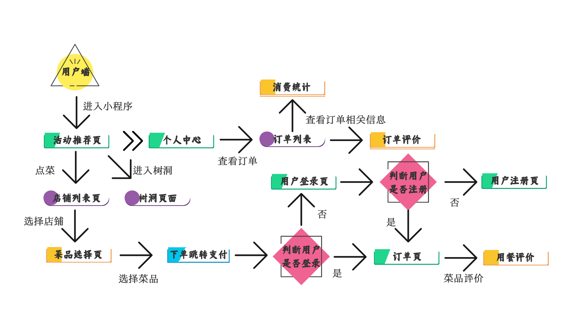</img>

##### 一、首页

小程序**首页**包括饭堂点餐、发布失物招领、积分商城和查看失物招领这四个模块，小程序用户可以根据自己的需要点击进去相应的模块，例如你有点餐需求，那么就点进去饭堂点餐这个模块。

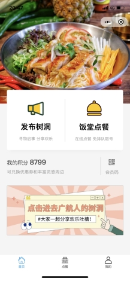

##### 二、饭堂点餐模块

进入饭堂点餐界面，可以看到很多家餐饮店，用户可以根据自己的喜好选择某一家店，点进去这一家店后，用户可以选择自己喜欢的菜品了，选定好菜品之后，便可以按下右下角的结算按钮进行结算，用户可以选择自取或者外卖，如果是选择取号的，在支付完成后便会出现一个取餐号，这时顾客到店里等候取餐，如果是选择外卖服务的话，添加地址，电话号码等待外卖送到即可。

步骤：选择某一家店→选择菜品→选择取号或者是外卖→下单结算→付款（付款模块没实现）→完成点餐操作

  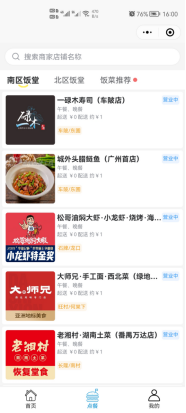      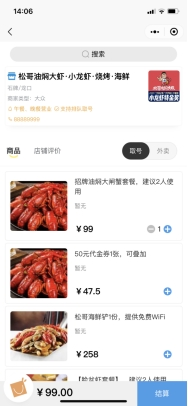     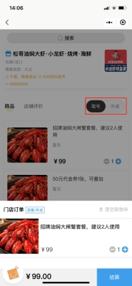       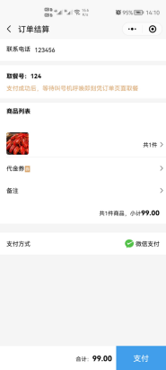   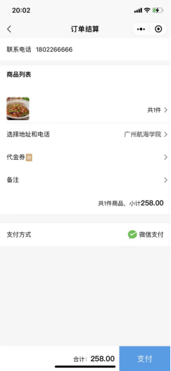  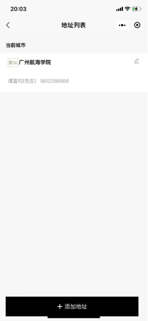

  

##### 三、校园树洞模块

树洞模块主要是统一用户使用该渠道获取失物招领的信息，并且更直观地了解失物招领的详细信息以及更好地方便工作人员整理，并且可以在树洞模块中吐槽校园的一些事，发布招领信息可以从首页的发布树洞进入，查看信息可以从首页下方的广航人的树洞进入，同时，小程序也支持发表评论和删除评论。

步骤：

①发布树洞：小程序首页→点击发布树洞→输入发表内容→发布

②查看树洞：小程序首页→点击图片广航人的树洞→查看树洞信息

③发表评论：小程序首页→进入树洞→点击评论→输入评论内容→发表评论

④删除评论：点击自己评论的信息→弹出删除→点击删除→删除完成

</img>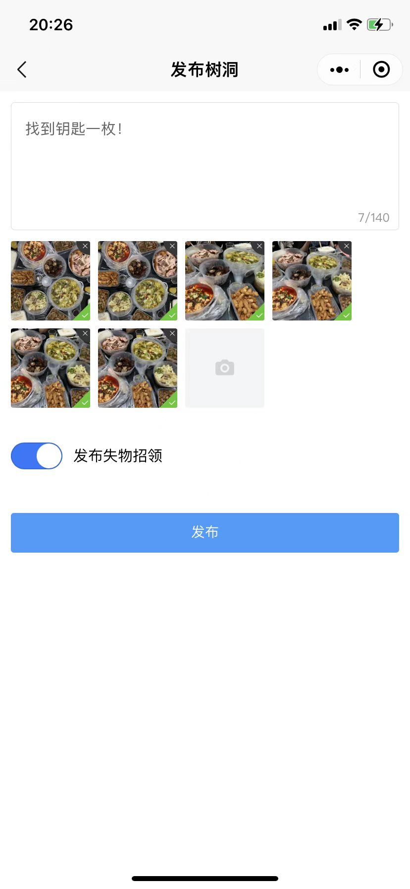</img>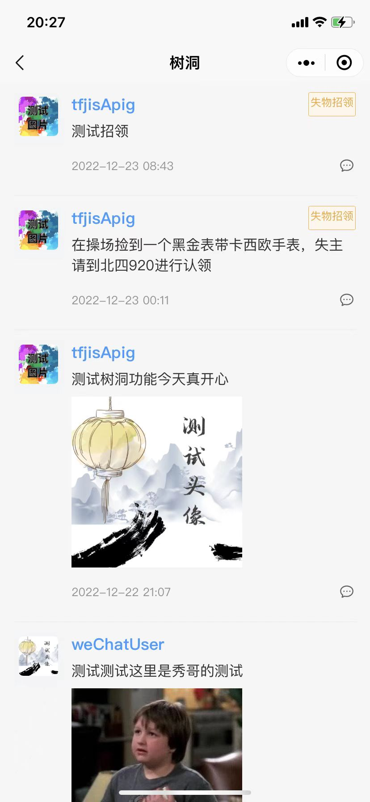</img>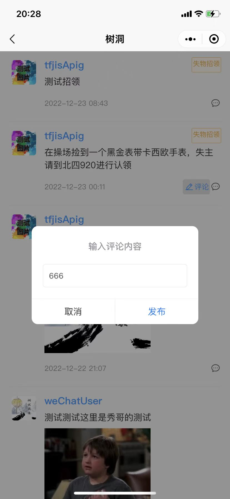</img>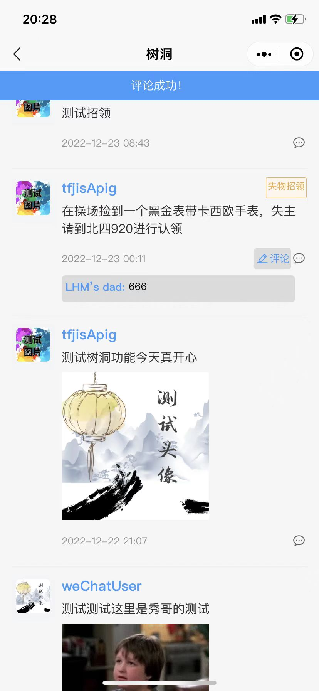</img>

##### 四、积分商城模块

用户获得的积分可以在积分商城进行兑换，用积分换取相应的代金券，代金券在用户选择外卖服务时可以抵扣。

步骤：进入积分商城→选择兑换的代金券→立即兑换→兑换成功

备注：优惠券可以在小程序“我的”，代金券那一栏查看。

 

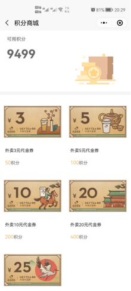       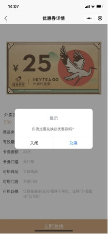

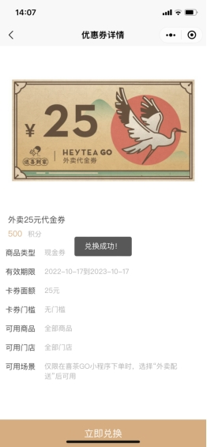   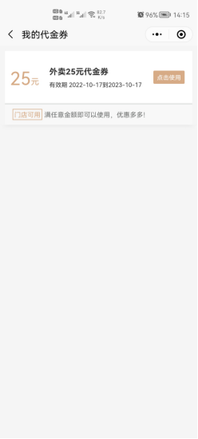

##### 五、登录模块和订单模块

用户点击小程序右下角“我的”可以登录和退出账号，账户的头像，昵称，手机号码等可以自主修改；个人消费会统计这个账户今天总共消费的金；代金券是用积分兑换而来的，可在下单时抵扣；“我的订单”一栏可以查看之前所有的订单，并且可以进行评价；会员码需要开通钱包支付，用钱包支付可以获得一定的积分；对于小程序使用过程中出现的问题可以点击小程序“我的”，联系客服；同时，用户也可以填写反馈意见，小程序开发者会收集这些意见，并且在今后的维护中提高用户的体验感。

备注：

账号登录：小程序“我的”一栏→点击一键登录即可登录账号

账号退出：小程序“我的”一栏→退出登录

账号更换信息：点击头像进行更改

查看订单：小程序“我的”一栏→点击我的订单→查看订单

订单评价：小程序“我的”一栏→点击我的订单→查看订单→去评价→完成评价

  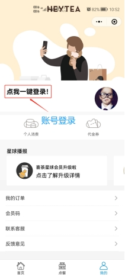     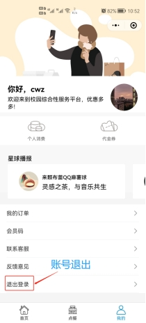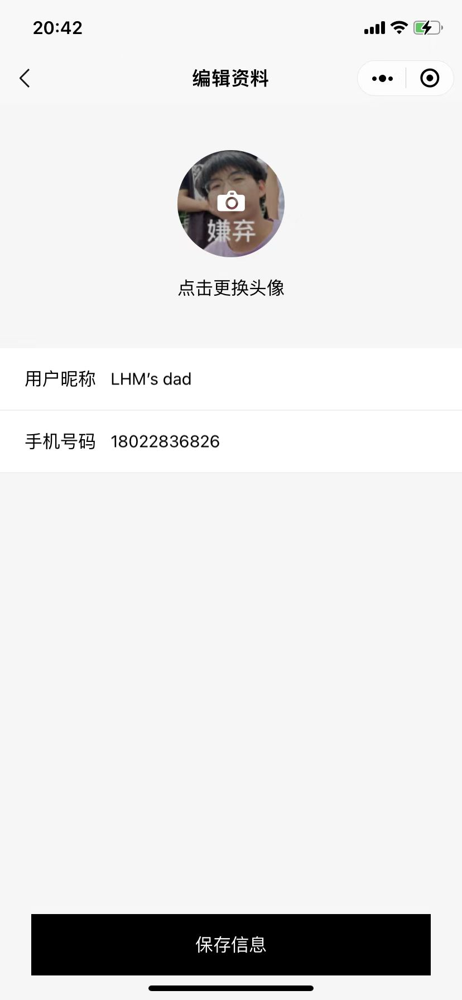</img>
 
 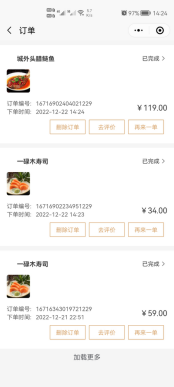       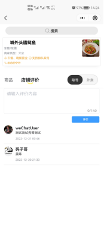
 
 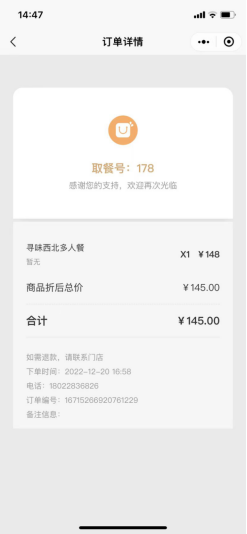  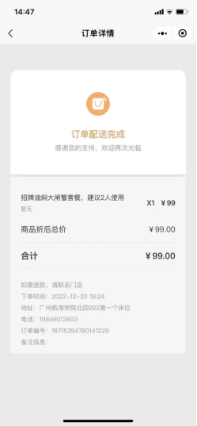
